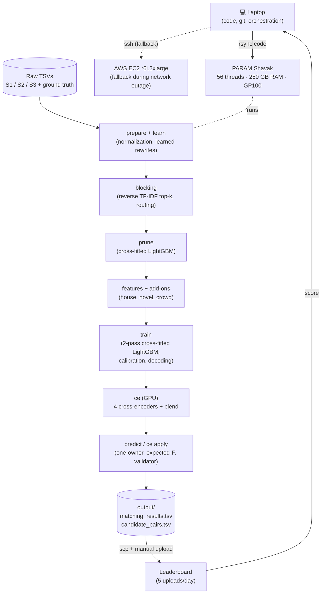
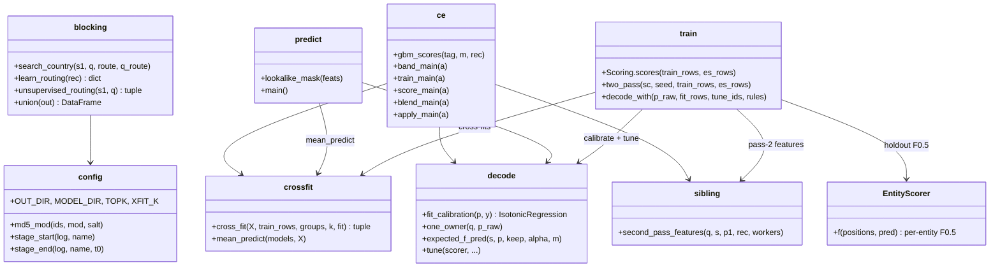
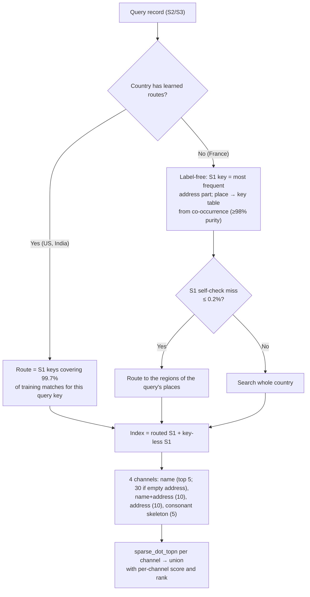
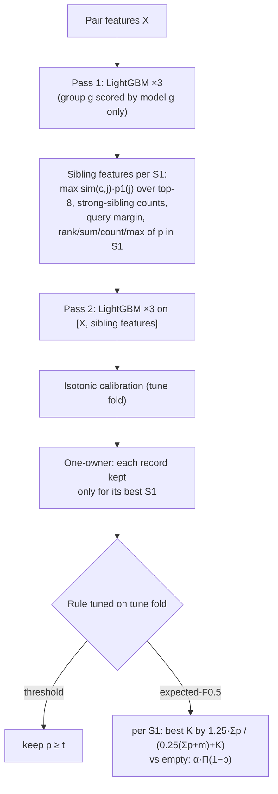
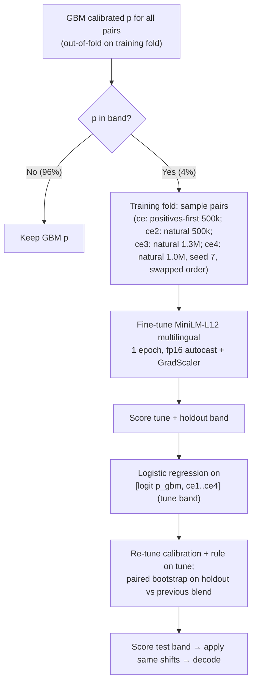
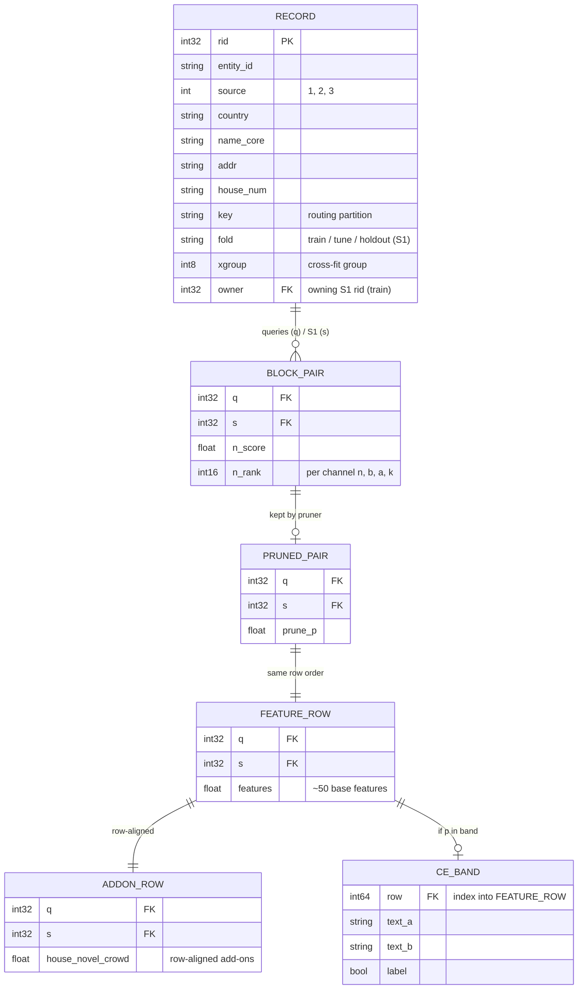
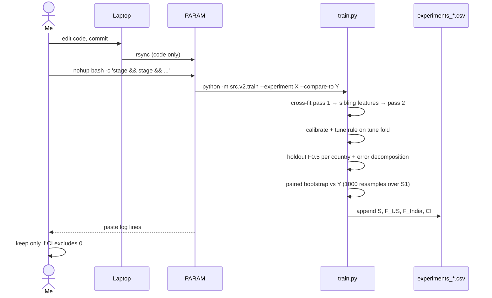
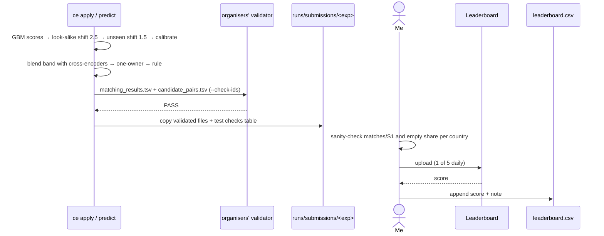

# Business Entity Resolution (Amazon ML Challenge 2026) — Interview Deep Dive

> **One-liner:** Built a large-scale entity-resolution pipeline in Python (TF-IDF reverse blocking, cross-fitted LightGBM, fine-tuned multilingual cross-encoders) that matched ~10M noisy business records to 1.7M reference entities across three countries and reached a 0.9806 macro F0.5 on the public leaderboard.

---

## 1. Elevator Pitches

### 30-Second
"In the Amazon ML Challenge 2026 we had to match noisy business records from two sources to a reference list of about 1.7 million businesses in the US, India and France, where France had no training labels at all. I built a four-stage pipeline: fuzzy text search to find candidates, a learned pruner, a two-pass gradient-boosted matcher, and at the end fine-tuned multilingual cross-encoders that re-score only the 4% of pairs the matcher is unsure about. The thing I'm proudest of is the validation discipline: every change had to beat the previous model on a leakage-free holdout with a paired bootstrap before it was allowed to use one of our five daily leaderboard uploads. Our final public score was 0.9806."

### 2-Minute
"The challenge was entity resolution: for each Source-1 business, return every Source-2 and Source-3 record that refers to it, scored by macro F0.5 per entity, so precision counts four times as much as recall and a business with no true match only scores if you predict nothing. The data was about 12.5 million training records and 11.7 million test records; names were misspelled, transliterated from Indian scripts or rewritten, and address parts were shuffled.

I split the problem the classic way. First, *reverse blocking*: every S2/S3 record searches the S1 records of its own country with character n-gram TF-IDF over four different text views, restricted to its state or region by a routing table learned from the training matches. For France, which had no labels, I learned the region routing from the addresses themselves and gated it with a self-check, and validated the idea by pretending India was unseen: it lost only 0.04% of true pairs. Second, a cross-fitted LightGBM pruner cuts that union to 10–35 candidates per business. Third, a two-pass LightGBM matcher with about 75 features, including features that describe how the data generator creates look-alike businesses, like 'the candidate appends a word that isn't a variant of any word in the name' and 'the house number differs by a small gap on the same street'. Decoding enforces that each record belongs to at most one business and picks, per business, the set of matches that maximises expected F0.5, including the option of predicting nothing.

The last jump came from rescoring uncertain pairs with four fine-tuned multilingual MiniLM cross-encoders, blended with the matcher by a logistic regression fitted on a tune fold. That took us from 0.9753 to 0.9806.

The main lesson was about validation. A synthetic 'test-like' holdout I built predicted a +0.016 gain for one idea that actually lost 0.002 on the leaderboard, while gains on the real holdout transferred every time. If I continued, I'd attack the blocking recall ceiling and train the cross-encoders with labels closer to France's distribution."

---

## 2. Problem Statement

**What problem does this solve?**
Given three sources of business records (S1 is the reference list; S2 and S3 are noisy copies), return for each S1 entity the set of S2/S3 records that describe the same business. Each S2/S3 record belongs to at most one S1 entity (verified over 7.64M training links), 5.6% of S1 entities have no match at all, and about 26% of S2/S3 records match nothing. The records carry deliberate noise: typos, legal-form changes ("Pvt Ltd", "SARL"), native-script Indian names (23.6% of India S2 names), shuffled address parts, house numbers transformed by a small set of operators, and "look-alike" businesses (siblings on the same street with a different house number or an extra word in the name). The test set adds France, a country with no training data.

**Why is this technically interesting?**
- **Scale:** comparing every S2/S3 record with every S1 of its country is on the order of 10^12 pairs. Blocking has to be both fast and near-lossless.
- **Asymmetric metric:** macro F0.5 per entity punishes false merges ~4× more than misses. An S1 with no true match scores 1 only for an empty prediction. So decoding, not just scoring, matters.
- **Distribution shift:** France is unseen, and US/India test holds 1.6–1.9× more next-door look-alikes than train (measured label-free, see Challenge 2).
- **Validation:** only five leaderboard uploads per day, so every decision had to be validated offline without leaking labels across entities.

**Scope & Constraints**
- 72-hour contest (25–27 Sep 2026), team of three. This pipeline ("v2") was one of the team's two pipelines.
- Rules: no external data or APIs; models ≤ 8B parameters; permissive licenses only (MIT/BSD/Apache/ISC); country is an open set, so no hard-coding of country as a model feature (France-specific normalization only behind an explicit `country == "France"` check).
- Compute: a shared university server (PARAM Shavak: 56 threads, 250 GB RAM, one Quadro GP100 16 GB, Pascal so fp16 not bf16, disk 97–100% full) with a 32-worker etiquette cap, plus a small AWS fallback used while the university network was down.
- Five leaderboard uploads per day.

---

## 3. High Level Design (HLD)

### 3.1 System Architecture Diagram

This is an **offline batch pipeline**, not a service. Every stage is a `python -m src.v2.<stage>` process that reads Parquet tables from `runs/v2/<tag>/` and writes new ones, so stages are stateless and restartable. The one hard boundary is **train vs test**: anything learned (vocabularies, routing, rewrites, models, calibration, decoding parameters) is fitted on training data and only *applied* to test. The exceptions are the label-free parts: IDF and routing for France, fitted on France's own unlabelled test text.

### 3.2 Data Flow Diagram

```mermaid
flowchart LR
    Raw["Raw records\n~24M train+test"] --> Norm["Normalize\nanyascii · legal forms · house nos"]
    Norm --> Keys["Partition keys\n(state / region)"]
    Keys --> Block["Reverse blocking\n4 TF-IDF channels, top-k"]
    Block --> Prune["Pruner\n~10–35 cands / S1"]
    Prune --> Feats["~75 pair features"]
    Feats --> GBM["LightGBM pass 1\n→ sibling features → pass 2"]
    GBM --> Cal["Isotonic calibration"]
    Cal -->|"p in [0.02, 0.98]\n(4% of pairs)"| CE["Cross-encoders ×4\n+ logistic blend"]
    Cal -->|"confident pairs"| Dec
    CE --> Dec["One-owner +\nthreshold / expected-F0.5"]
    Dec --> Val["Organisers' validator"]
    Val --> Sub["Submission TSVs"]
```

Raw records are normalized once. Blocking turns ~10M queries into a candidate union, and the pruner cuts it to 30.6M (train) / 34.8M (test) pairs. The matcher scores every pair, and only the uncertain band (1.45M test pairs) is sent to the GPU cross-encoders. Decoding turns pair probabilities into one set of matches per S1, and the validator gates the write.

### 3.3 Component Responsibilities

| Component | Responsibility | Communication Style | State |
|-----------|---------------|---------------------|-------|
| `prepare.py`, `normalize.py`, `learn.py` | Normalize raw text; learn rewrites + native-script dictionary from training matches; assign folds and partition keys | CLI → Parquet (`records.parquet`) | Stateless; writes learned tables to `model/` |
| `blocking.py` | Reverse top-k TF-IDF search per country, learned + label-free routing, recall report | CLI → `pairs_block.parquet` | Stateless; saves vocabularies/routing |
| `prune.py` | Cross-fitted LightGBM pruner, per-country recall-budget cutoffs | CLI → `pairs_pruned.parquet` | Stateless; saves pruner |
| `features.py`, `house.py`, `novel.py`, `crowd.py` | Pair features and add-on feature tables (row-aligned) | CLI → Parquet | Stateless |
| `train.py`, `crossfit.py`, `sibling.py`, `decode.py` | 2-pass cross-fitted matcher, calibration, decoding tuned on tune fold, holdout report + paired bootstrap | CLI → `matcher_<exp>.pkl`, per-entity scores | Stateless |
| `ce.py` | Band dump, cross-encoder fine-tune/score (GPU), blend, apply | CLI → Parquet + HF model dirs | Stateless |
| `predict.py` | Test scoring, predict-time shifts, one-owner, decoding, validator, submission files | CLI → `output/`, `runs/submissions/` | Stateless |
| `leaderboard.py`, `errors.py`, `shiftcheck.py`, `prior.py` | Bookkeeping, error mining, diagnostics (never feed training) | CLI | Stateless |

### 3.4 System Properties (CAP / Consistency Model)

This is a single-machine batch pipeline, so CAP doesn't apply in the usual sense. The properties that actually matter are:

- **Consistency = reproducibility and alignment.** Every add-on feature table is row-aligned with `features.parquet`, and `add_addon()` refuses to run if `q`/`s` don't match (`src/v2/train.py`). Folds use md5 of the entity id (`config.md5_mod`), so they're stable across runs. All samplers and LightGBM use seed 42.
- **Leakage safety.** Cross-fitting (`src/v2/crossfit.py`): a training row is scored only by the model that didn't see its entity's group; everything else gets the mean of the K=3 models. So train, holdout and test probabilities have one distribution. A unit test enforces this (`test_cross_fit_never_scores_a_training_row_with_a_model_that_saw_it`).
- **Availability / failure behavior.** Each stage calls `config.stage_start()`, which logs RAM/disk and **aborts** if free disk is below `V2_MIN_FREE_GB` (the shared disk was 97–100% full). Failures are fail-fast: shell chains use `&&`, and a crashed stage leaves the previous stage's outputs intact, so a rerun resumes from there. The cross-encoder trainer has an optional wall-clock hard stop that keeps the checkpoint only if at least 50% of the epoch is done.
- **Single point of failure:** the one shared server. When the university network went down, I moved runs to AWS (EC2 + S3 backup), then moved back.
- **Latency budget:** not a request/response system. Measured stage times: test predict ≈ 11 min (639–656 s), cross-encoder fine-tune ≈ 28.5 min per 500k pairs at ~300 samples/s, test band scoring ≈ 11–13 min per model at ~1,500–2,300 pairs/s. The end-to-end rebuild of 8–10 hours is an estimate from the stage timings; the full chain was never run in one go. `[INFERRED — verify before interview]`

### 3.5 Non-Functional Requirements (NFR)

| NFR | Current State | Production Target | Gap to Bridge |
|-----|--------------|-------------------|---------------|
| Runtime (full rebuild) | Estimated 8–10 h `[INFERRED — verify before interview]`; stages measured individually (above) | Incremental daily run for new records | Persist indexes and models; score only new or changed records |
| Throughput | ~10M test queries per batch; CE scoring ~1,500–2,300 pairs/s on one GP100 | Streaming match on insert | Serve the pruner + matcher behind an API; keep blocking indexes warm |
| Availability | One shared server; manual AWS fallback | Scheduled, retried jobs | Workflow orchestrator (Airflow / Prefect) with retries and checkpoints |
| Security | No auth needed (offline, no service) | Access-controlled data lake | IAM + encrypted storage for business data |
| Observability | Per-stage logs with resource snapshots; experiment ledgers (`experiments_*.csv`, `leaderboard.csv`) | Metrics + alerting on recall/precision drift | MLflow / W&B tracking; drift monitors on label-free statistics (matches per S1, empty share) |
| Data durability | Parquet on local disk; S3 backup during the AWS phase | Versioned datasets | DVC / Delta tables with lineage |

### 3.6 Scalability Strategy

The pipeline is partitioned by country, and within a country by routing key (state or region). So the dominant cost, the sparse top-k matrix product in blocking, splits into independent sub-problems: learned routing cut US queries' search space from 663k to about 49k S1 per query. Stages already parallelize over processes (`multiprocessing` pools) and threads (sparse_dot_topn, LightGBM). The natural next step for 10× data is running those partitions as independent jobs on a cluster (Ray or Spark), keeping the same Parquet contracts. `[INFERRED — verify before interview]` The first bottleneck would be memory: feature matrices of ~30M rows × ~95 float32 columns are ~12 GB and are copied during cross-fit scoring. After that comes GPU time for the cross-encoders, which already scale by only scoring the uncertain 4% band.

---

## 4. Low Level Design (LLD)

### 4.1 Core Module / Class Design

The code is a **stage-per-module pipeline**: functional modules with a thin CLI each, communicating only through Parquet tables and pickled model artefacts under `runs/v2/`. Business logic (features, decoding, routing) sits in pure functions that the unit tests call directly (`tests/test_v2.py`, 20 tests). I/O and resource guards live in each module's `main()`.

### 4.2 Key Algorithm / Logic Walkthrough

#### Algorithm 1: Reverse blocking with learned and label-free routing

**What it does:** For every S2/S3 record, finds the top-k most similar S1 records of its country across four TF-IDF "views", searching only the S1 partitions its address points to.

**Why it's non-trivial:** Brute force is ~10^12 comparisons. Routing must be near-lossless (a routing miss is an unrecoverable recall loss), and France has no labels to learn routes from.

**Edge cases handled:**
- Empty-address queries get a larger name top-k (30).
- The skeleton channel only runs for non-Latin names.
- Key-less S1 records are always searchable.
- Queries whose places point to more than 2 regions search the whole country.
- Label-free routing turns itself off when its self-check fails. For US treated as unseen, the check was 0.61% (city names compete with states), so routing stayed off with 0 pairs lost.
- Validated against labels: India treated as unseen lost 0.04% of true pairs with a 7.4× smaller index. On France test: 3 regions, self-check 0.0, 97% of queries routed, index 259k → 93k.

**Code path:** `src/v2/blocking.py → learn_routing(), unsupervised_routing(), search_country()`

#### Algorithm 2: Cross-fitted two-pass matcher with one-owner, expected-F0.5 decoding

**What it does:** Scores every candidate pair, adds "sibling evidence" from first-pass scores, calibrates, then chooses each S1's match set to maximise expected F0.5.

**Why it's non-trivial:** Second-pass features computed from first-pass probabilities leak labels unless the first pass is out-of-fold. And the metric is per entity, so a per-pair threshold isn't optimal.

**Edge cases handled:**
- **Empty is an explicit option.** The "predict nothing" choice competes with every K, which matters because a no-match S1 scores 1 only when empty.
- **Blocking misses are accounted for.** `m` adds the expected number of true matches blocking missed, measured on the tune fold.
- **Ties are broken on raw probability.** One-owner uses the raw scores, since isotonic calibration produces ties.
- **Countries without training data** can get a stricter parameter via an unseen-country offset or logit shift.

**Code path:** `src/v2/train.py → two_pass(), decode_with()`; `src/v2/sibling.py → second_pass_features()`; `src/v2/decode.py → expected_f_pred()`

#### Algorithm 3: Cross-encoder rescoring of the uncertain band

**What it does:** Re-scores only pairs with calibrated GBM probability in [0.02, 0.98] using fine-tuned cross-encoders on raw "name | address" text, blending them with the GBM through a logistic regression.

**Why it's non-trivial:**
- The cross-encoders must be trained only on training-fold entities, with out-of-fold GBM scores, or the blend is biased.
- The blend has to be fitted and judged on separate folds.
- Everything had to fit a shared Pascal GPU (fp16, no bf16) under a hard wall-clock stop.

**Edge cases handled:**
- **Existing scores are reused.** Rows already scored for the default band keep their logits when a wider band is tried; only new rows go to the GPU.
- **Sanity check:** the blend reproduces the GBM-only holdout exactly (0.9868 / 0.9837) before comparing.
- **Synthetic rows get consistent text.** Synthetic look-alikes copy their source's raw text, so the same house-digit and word edit is re-applied to the raw strings.

**Code path:** `src/v2/ce.py → band_main(), train_main(), score_main(), blend_main(), apply_main()`

### 4.3 Data Model & ER Diagram

There's no database. The "schema" is a set of Parquet tables keyed by integer record ids (`rid`, int32), plus pickled model artefacts.

| Entity | Purpose | Key Constraints | Indexed On |
|--------|---------|-----------------|------------|
| RECORD (`records.parquet`) | One row per raw record, normalized | `rid` = row position; `owner` ≥ 0 only for matched train S2/S3 | Positional (numpy arrays indexed by rid) |
| BLOCK_PAIR / PRUNED_PAIR | Candidate pairs | Sorted by (q, s); unique | (q, s) packed into int64 for `searchsorted` joins |
| FEATURE_ROW + ADDON_ROW | Model inputs | Add-ons must match q/s row-for-row (checked) | Row order |
| CE_BAND | Cross-encoder inputs | `row` points into the feature table | `row` |

**Query patterns this schema is optimized for:**
- Group-by-S1 and group-by-query aggregations for context, sibling and decoding features. These are done with numpy `bincount` / `lexsort` / pandas `groupby` on int arrays.
- Label lookups: `owner[q] == s`.
- Membership joins by packing (q, s) into one int64 and using `searchsorted`.

**What changes at scale:** Positional int32 ids and whole-table numpy arrays are fast but in-memory. At 10× the data the tables should be partitioned by country/key and processed out of core (Arrow datasets / Spark), and the (q, s) join keys would need int64 ids. `[INFERRED — verify before interview]`

### 4.4 Sequence Diagrams for Key Flows

#### Flow 1: Training and validating one experiment

Stages are chained with `&&` inside `nohup` so they survive disconnects. I couldn't SSH into the server programmatically (password-only), so every run was started by pasting commands and reading logs back. The "keep" gate is a statistical test, not eyeballing a point estimate.

#### Flow 2: Producing and scoring a submission

Files are only copied to `runs/submissions/` if the organisers' validator passes. Before every upload I compared per-country "matches per S1" and "empty share" to the previous file, as a label-free guard against a broken run.

### 4.5 Design Patterns Used

| Pattern | Where It's Applied | Why It Was Chosen |
|---------|-------------------|-------------------|
| Pipeline / stage-per-module | `src/v2/*.py`, `scripts/run_final.sh` | Each stage is restartable from its inputs, which mattered on a shared server with outages and disk limits |
| Cross-fitting (out-of-fold stacking) | `crossfit.py`, used by pruner, matcher, second pass, cross-encoder band | Stacked models need out-of-fold inputs; the module docstring states the "one distribution in train, holdout and test" goal |
| Strategy (decoding rules) | `decode.predict(rule, ...)`: threshold vs expected-F | Rule chosen per model on the tune fold without changing callers |
| Feature-flag / ablation groups | `features.GROUPS`, `--exclude-groups`, add-on flags `--house --novel --crowd` | Every feature group can be ablated with the same bootstrap |
| Guard clauses / fail-fast | `config.stage_start()` disk guard, `add_addon()` alignment check | Protects a shared 97%-full disk and prevents silent misalignment |

---

## 5. Tech Stack — With Justification

| Layer | Technology | Why This | What Was the Alternative |
|-------|------------|----------|--------------------------|
| Language | Python 3.12 | Data/ML ecosystem; same venv on the server and AWS | — |
| Tabular data | pandas 3, numpy, pyarrow (Parquet) | Columnar, typed, fast reload between stages | CSV, rejected for size/speed on 30M-row tables `[INFERRED — verify before interview]` |
| Candidate search | scikit-learn TfidfVectorizer (char_wb 2–4) + **sparse_dot_topn** | Multi-threaded sparse top-k matmul avoids materializing all similarities | FAISS dense channel was planned for native scripts but not needed (listed as "planned, not installed" in `requirements.txt`) |
| Fuzzy matching | **rapidfuzz** (token_set, ratio, Jaro-Winkler, cdist) | Fast C++ string metrics with batch `cdist`/`cpdist` | python-Levenshtein / difflib (slower) `[INFERRED — verify before interview]` |
| Normalization | **anyascii**, cleanco | Transliteration of Indian scripts and French accents; legal-form list | Learned dictionaries on top (`learn.py`) |
| Models | **LightGBM** 4.7 | Fast on ~30M rows × ~95 features, categorical support, CPU-only | XGBoost/CatBoost were in the prep repo; LightGBM stayed for speed `[INFERRED — verify before interview]` |
| Calibration | scikit-learn IsotonicRegression, LogisticRegression (blend) | Monotone calibration for decoding; simple, fold-safe blender | — |
| Transformer | PyTorch 2.5.1 (cu121), transformers, `paraphrase-multilingual-MiniLM-L12-v2` | Apache-2.0, ~118M params (within the 8B cap), multilingual for Indian/French text, small enough for a Pascal GPU at ~300 samples/s | xlm-roberta-base was the named alternative for a newer GPU (planned, not used) |
| Compute | PARAM Shavak (CPU + GP100), AWS EC2 r6i.2xlarge fallback | Free university compute; AWS only during the network outage, within a $100 budget | Larger AWS instances, blocked by the account's vCPU quota (16) |
| Orchestration | bash + `nohup` chains, rsync, per-stage logs | No admin rights on a shared box (no Docker/conda/sudo) | Workflow engines, unavailable/overkill for 72 h |

---

## 6. Architecture & System Design Decisions

### Decision 1: Reverse blocking (S2/S3 queries S1), not S1 → candidates
**Context:** Each S2/S3 record belongs to at most one S1, and an S1 can own many records.
**Options considered:**
- **Option A, forward:** each S1 searches for its records. It needs a variable number of candidates per S1.
- **Option B, reverse:** each S2/S3 searches S1 top-k. It gives a fixed, small k per query.

**What we chose:** Reverse (`blocking.py` docstring: "Every S2/S3 record (query) searches S1 records of its own country").
**Reasoning:** With a fixed top-k per query, the one-owner structure maps directly onto "pick the best S1 for this record". `[INFERRED — verify before interview]`
**Tradeoff accepted:** Candidates per S1 vary (US 9.8, India 23.8, France 34.9), which sets the size of `candidate_pairs.tsv`.
**How this evolves at scale:** Shard the S1 index by routing key and run queries per shard in parallel.

### Decision 2: Full-density validation with md5 folds and cross-fitting
**Context:** An early validation that thinned the candidate pool overstated scores. The v2 design explicitly blocks against all training records.
**Options considered:**
- **Option A:** a random pair-level split. It leaks entities across folds.
- **Option B:** entity-level md5 folds (85% train / 5% tune / 10% holdout), all training records present in blocking, and K=3 cross-fitting.

**What we chose:** B (`config.md5_mod`, `crossfit.py`, documentation §2.2).
**Reasoning:** Holdout entities face the same competition density as test entities. The design is stated in the docstrings and the documentation.
**Tradeoff accepted:** Three model fits per pass. Plus the holdout F doesn't account for test's distribution shift (see Challenge 1).
**How this evolves:** Add a time- or source-shifted validation slice to catch covariate shift earlier.

### Decision 3: A statistical keep/drop gate for every change
**Context:** Five uploads per day; small holdout gains (+0.0002) are easy to over-read.
**Options considered:**
- **Option A:** judge on the leaderboard.
- **Option B:** judge on the holdout point estimate.
- **Option C:** paired bootstrap over S1 entities, 1000 resamples.

**What we chose:** C, with the decision score S = 0.383·F_US + 0.468·F_India + 0.150·LOCO_avg, and 3 seeds when |ΔS| < 0.002 (`decision.paired_bootstrap`).
**Reasoning:** A change was kept only when its confidence interval excluded zero. This is what let the cross-encoders' +0.0002–0.0008 steps be trusted.
**Tradeoff accepted:** Slower iteration, since every candidate needed a full train.

### Decision 4: One-owner + expected-F0.5 decoding instead of a per-pair threshold
**Context:** The metric is macro F0.5 per S1, and a no-match S1 only scores with an empty prediction.
**Options considered:** a global threshold, or a per-entity expected-F optimiser with an explicit empty option.
**What we chose:** Both rules, with the tune fold choosing per model (`decode.tune`). Late models picked expected-F (α 0.75–2.0), and the three-cross-encoder blend picked threshold 0.72.
**Tradeoff accepted:** Decoding parameters are tuned on the tune fold, which is only 5% of entities.

### Decision 5: House-number relation and gap features, plus a look-alike logit shift
**Context:** In true matches the house number changes by specific operators (leading zeros, dropped digit, prefix, ±1/2), and test holds 1.6–1.9× more next-door look-alikes.
**Options considered:** a single "same / different house number" flag, or operator-level relation, digit edit distance, containment and numeric gap.
**What we chose:** Operator-level features (`house.py`, `REL` codes, `GAP_SMALL = 20`), plus a predict-time logit shift of −2.5 for known-different numbers. The 2.5 came from a teammate's leaderboard probes and is disclosed in the documentation.
**Measured:** Gap features were +0.0005 on the holdout and +0.0027 on the leaderboard. The shift gave +0.0048 on the leaderboard.

### Decision 6: Label-free routing for unseen countries, gated by a self-check
**Context:** France had no labels, so it searched all 259k S1 per query.
**Options considered:** no routing; hard-code French regions (disallowed by the "country is an open set" rule); or learn keys from co-occurrence without labels.
**What we chose:** Co-occurrence routing with a self-check miss threshold of 0.2% (`unsupervised_routing`).
**Measured:** It was neutral on score (0.97525 → 0.975281) and reduced France candidates from 38.7 to 34.9 per S1.
**Tradeoff accepted:** Adds complexity for a neutral score effect. The justification is the smaller candidate set, since the organisers audit `candidate_pairs.tsv` for its reduction ratio.

### Decision 7: Rescore only the uncertain band with cross-encoders
**Context:** Scoring 35M pairs with a transformer on one Pascal GPU wasn't feasible in the time left.
**Options considered:** score everything; score the band [0.02, 0.98]; score a wider band [0.005, 0.995].
**What we chose:** [0.02, 0.98], which is 4.1% of pairs. Widening it was tested: +0.0000 US / +0.0001 India, not significant, so it was dropped.
**Tradeoff accepted:** Errors outside the band (e.g. 502 holdout wrong accepts with p > 0.98) are untouched.

### Decision 8: Reject a validated synthetic-data idea because the leaderboard disagreed
**Context:** I generated synthetic next-door look-alikes as hard negatives and built a "test-like" holdout containing them.
**What happened:** Test-like holdout: +0.016 F. Leaderboard: 0.9734 vs 0.97528 for the same pipeline without it.
**What we chose:** Drop the synthetic line, and from then on gate uploads only on the real holdout.
**Lesson:** A holdout built from your own generator measures fit to that generator, not to the test distribution.

---

## 7. API Design

**Style:** There's no network API. The interface is a **CLI per stage** (`python -m src.v2.<stage> --tag train|test ...`) plus file contracts. For a batch ML pipeline on a shared server with no admin rights, that was the simplest reliable interface.

**Key entry points:**

| Command | Purpose | Inputs | Outputs |
|---------|---------|--------|---------|
| `src.v2.prepare --split train\|test [--raw]` | Normalize, keys, folds, owners | raw TSVs | `records.parquet` |
| `src.v2.blocking --tag test --unsup-routing` | Candidate search | records, vocab, routing | `pairs_block.parquet` |
| `src.v2.prune --tag ...` | Pruner | pairs_block | `pairs_pruned.parquet` |
| `src.v2.features / house / novel / crowd --tag ...` | Features | pruned pairs | feature Parquets |
| `src.v2.train --experiment X --second-pass --house --novel --compare-to Y` | Matcher + validation | train features | `matcher_X.pkl`, per-entity scores, ledger row |
| `src.v2.predict --matcher ... --lookalike-shift 2.5 --unseen-shift 1.5` | GBM-only submission | test features | `output/*.tsv` |
| `src.v2.ce band\|train\|score\|blend\|apply` | Cross-encoder stage | gbm scores, raw text | band files, HF model dirs, blend pickle, submission |
| `scripts/run_final.sh [stage ...]` | End-to-end reproduction | raw data | final `output/` |

**Error contract:** Stages exit non-zero on failure (`SystemExit` with a message, e.g. `"... is not aligned with features.parquet: rebuild it"` or `"aborting: only N GB free"`). Chains stop at the first failure, and logs show which stage failed.

**Versioning strategy:** Experiments are versioned by name (`matcher_<exp>.pkl`, `runs/submissions/<exp>/`), recorded in `experiments_<host>.csv` and `leaderboard.csv`, and tied to git commits.

**Rate limiting:** Not applicable. The external "rate limit" was the five daily leaderboard uploads, handled by the offline gate in Decision 3.

---

## 8. Challenges & How I Solved Them

### Challenge 1: The validation set that lied
**What happened:** Synthetic look-alike training won +0.0159 (US) and +0.0154 (India) on the synthetic test-like holdout, with the confidence interval far from zero. On the leaderboard it scored 0.9734, against 0.97528 for the same pipeline without it.
**Why it was hard:** Every offline signal said "ship it". I had built the holdout specifically to mimic test.
**How I solved it:** I isolated the cause with paired uploads that differed in one component each: routing alone was neutral, so the synthetic model caused the whole drop. I reverted to the real-holdout line and made "significant on the real holdout" the upload gate. Every later gain passed that gate and transferred at roughly 1–2× (gap features +0.0005 → +0.0027; cross-encoders +0.0022/+0.0037 → +0.0042).
**What I'd do differently:** Spend one early upload to calibrate any new validation set against the leaderboard before trusting it.

### Challenge 2: Covariate shift measured without labels
**What happened:** Test US/India scores were well below the holdout. The France-empty probe split the 0.9726 score into ≈ 0.978 US+India and ≈ 0.937 France, against a holdout US+India of ≈ 0.985.
**Why it was hard:** There are no test labels, so the gap had to be explained label-free.
**How I solved it:**
- A shift study (`notebooks/v2_shift_study.py`) counted same-name, same-street candidates with a known different house number per S1. Test has 1.6–1.9× train, and test's look-alikes have a median gap of ~11 vs ~300 for true variants in train.
- An EM base-rate estimate (`prior.py`) found ~0 prior shift for US/India, which points to covariate shift rather than more no-match entities.
- That motivated the house-number gap features: +0.0027 on the leaderboard.

**What I'd do differently:** Run the shift study before feature work, not after the first uploads.

### Challenge 3: A country with no labels (France)
**What happened:** France is ~15% of the score and had zero training data.
**How I solved it:**
- Language-independent features: novel extra words, house-number operators, name crowd. The novel-word feature alone lifted implied France by +0.044 (from `sibling-novel-word-insight` notes and the leaderboard ledger `[INFERRED — verify before interview]`).
- France-only normalization behind an explicit country check.
- Label-free routing with the self-check.
- Two predict-time settings chosen with France-only paired uploads (unseen shift 1.5: 0.97532 vs 0.975281).
- A label-free sanity check on French decisions against training-label rates for the same patterns. For example, an empty-address name shared by 5+ S1 is 1.5–2.2% true in training, and the model rejects those in France too.

**What I'd do differently:** Use a leave-one-country-out model family from the start as a proxy for France.

### Challenge 4: Shared, fragile infrastructure
**What happened:**
- The server disk was 97–100% full, shared with other users.
- The university network went down for hours.
- AWS on-demand quota was only 16 vCPUs.

**How I solved it:**
- Every stage checks free disk at start and aborts below a threshold (configurable via `V2_MIN_FREE_GB`).
- Pipelines were chained so they resume from the last good stage.
- Runs moved to AWS (with an S3 backup) during the outage and back afterwards.
- A 32-worker cap was kept on the shared box.

---

## 9. Production Readiness Roadmap

The current implementation is scoped to a 72-hour competition on a shared server. Here's how I'd evolve it into a production entity-resolution service:

**P0 — Before any real traffic:**
- [ ] Package stages as containerized jobs under a workflow orchestrator (Airflow/Prefect) with retries and checkpoints, replacing `nohup` chains.
- [ ] Version datasets and models (DVC or Delta + MLflow model registry); tie every submission to data + code hashes.
- [ ] Label-free drift monitors per country: matches per S1, empty share, band size, score distribution.
- [ ] Integration tests for the full chain on a small sample dataset (the repo has a mini-dataset generator).

**P1 — Incremental and online:**
- [ ] Persist blocking indexes and score only new or changed records instead of full rebuilds.
- [ ] Serve the matcher + cross-encoder behind an API for match-on-insert, with the cross-encoder only on the uncertain band (a natural latency budget).
- [ ] Active learning: route band pairs for human review to create labels for new countries.

**P2 — Architectural evolution:**
- [ ] Distributed blocking (Ray/Spark) partitioned by routing key.
- [ ] Replace positional int32 ids with stable int64 keys and out-of-core Arrow datasets.
- [ ] Improve the recall ceiling: blocking loss is 0.0032 of F on the holdout, now the largest fixable-by-design loss after the band.

---

## 10. Interview Q&A Bank

**Q: Why did you build this?**
A: It was the Amazon ML Challenge 2026 task. Our team ran two pipelines and I owned this one. Entity resolution at this scale is a nice system-design problem: candidate generation, learning to rank, calibration, and decoding all have to line up with one asymmetric metric.

**Q: Walk me through the architecture.**
A: It's a batch pipeline of stages that talk through Parquet files. Normalize the records, then reverse blocking with four TF-IDF channels and routing. Then a cross-fitted pruner, about 75 pair features, and a two-pass LightGBM matcher with sibling features. After isotonic calibration, cross-encoders re-score the uncertain 4% band, and one-owner plus expected-F decoding picks each business's matches. The key boundary is that everything learned is fitted on train and only applied to test.

**Q: What was the hardest technical challenge?**
A: Validation. My synthetic "test-like" holdout said +0.016 and the leaderboard said −0.002. I isolated it with paired uploads that changed one component at a time, dropped the idea, and made the real holdout plus a paired bootstrap the only upload gate. Everything after that transferred.

**Q: How does blocking work under the hood?**
A: Each S2 or S3 record is a query against S1 records of its own country. There are four TF-IDF views: full name, name plus address, address only, and a consonant skeleton for native-script names. sparse_dot_topn does a multi-threaded sparse top-k, and the union keeps each channel's score and rank as features. Routing restricts a query to the states its address maps to; for France I learned those regions from co-occurrence without labels.

**Q: How would this scale to 10× the load?**
A: The work is already partitioned by country and routing key, so I'd run those partitions as independent jobs on a cluster. The first thing to break is memory: the feature matrices are about 12 GB at today's size and get copied during scoring. So I'd move to out-of-core Arrow datasets. GPU cost stays bounded because only the uncertain band is scored.

**Q: What would you change if you were starting over?**
A: Two things:
- Calibrate any new validation set against the leaderboard with one early upload.
- Measure the train/test shift before building features.

I'd also try cross-encoders much earlier. They were the single biggest late gain, +0.0042.

**Q: How did you choose LightGBM and the MiniLM cross-encoder?**
A: LightGBM because it trains fast on ~30M rows on CPU, and CPU was what we had plenty of. For the cross-encoder the constraints decided it: Apache-2.0, under the 8B limit, multilingual for Indian and French text, and small enough to run fp16 on a Pascal GPU at about 300 samples a second.

**Q: What design patterns are in here?**
A: Mostly three:
- **Stage-per-module pipeline** with file contracts, so stages restart independently.
- **Cross-fitting**, an out-of-fold stacking pattern that keeps second-pass and blend inputs unbiased.
- **Strategy** for the decoding rule: threshold vs expected-F, chosen per model on the tune fold.

**Q: How do you ensure data consistency?**
A: Add-on feature tables must be row-aligned with the base features, and the loader refuses to run if they aren't. Folds come from an md5 hash of the entity id, so they're stable across runs. There's a unit test that cross-fitting never scores a training row with a model that saw it.

**Q: How is auth handled?**
A: There's no auth because there's no service; it's an offline pipeline on a university server under my own account. In production I'd put the data behind IAM with encrypted storage, and any match API behind OAuth2.

**Q: What's your testing strategy?**
A: There are unit tests for the non-obvious logic: 20 in `tests/test_v2.py`, covering normalization rules, the France-only rules not touching other countries, fold stability, the cross-fit leakage guarantee, the expected-F decoder picking K or empty, the house-number operators, the novel-word feature, and EM prior recovery. On top of that, every model change had to pass a paired bootstrap on the holdout. There's no end-to-end integration test on a small dataset. That's the first thing I'd add.

**Q: What are the failure modes?**
A:
- **Disk full on the shared server:** stages abort at start, before writing anything.
- **Misaligned add-on tables:** the loader raises.
- **A crashed stage:** the `&&` chain stops, and the previous outputs are intact for a rerun.
- **Network outage:** runs moved to AWS.
- **The model itself:** the biggest real failure mode was distribution shift, which the holdout can't see. That's why I compared per-country "matches per S1" and "empty share" before every upload.

**Q: How would you add a new country?**
A: Nothing is hard-coded to US or India. A country without labels gets its own TF-IDF vocabulary and IDF fitted on its unlabelled text, and label-free routing if its self-check passes. It also gets the least strict pruner cutoff and the unseen-country shift. With some labels, it would join training and get learned routing automatically.

**Q: What's the runtime profile of a submission?**
A:
- **Measured:** test predict takes about 11 minutes, each cross-encoder about 28 minutes per 500k training pairs, and test band scoring 11–13 minutes per model.
- **Estimated:** a full rebuild from raw data at 8–10 hours. I never ran it end to end in one go.

**Q: What was the impact of each major component?**
A: Leaderboard: baseline 0.763 → v2 first version 0.938 → learned rewrites and extra indexes 0.952 → second pass, house features, calibration 0.960 → novel-word features 0.9678 → look-alike shift 0.9726 → gap features 0.97525 → France routing and shift 0.97532 → cross-encoders 0.9795 → 0.980176 → 0.9806.

---

## 11. Resume Bullet Points

- **Architected** a large-scale entity-resolution pipeline in Python (pandas, LightGBM, PyTorch) matching ~10M noisy business records to 1.7M reference entities across three countries; reached 0.9806 macro F0.5 on the Amazon ML Challenge 2026 public leaderboard.
- **Designed** reverse candidate blocking with multi-channel character n-gram TF-IDF and multi-threaded sparse top-k search (sparse_dot_topn), with learned state routing and a label-free, self-validating region routing for an unlabelled country (0.04% true-pair loss at a 7.4× smaller search index when validated on a held-out country).
- **Built** a cross-fitted two-pass LightGBM matcher with ~75 engineered features, isotonic calibration, one-owner constraint and expected-F0.5 set decoding, validated with entity-level md5 folds and paired bootstrap tests.
- **Fine-tuned** four multilingual MiniLM cross-encoders (PyTorch, Hugging Face Transformers, fp16) to rescore the 4% uncertain band and blended them with the GBM, improving holdout F0.5 by +0.0028 (US) / +0.0047 (India) and the leaderboard from 0.9753 to 0.9806.
- **Diagnosed** train/test covariate shift without labels (1.6–1.9× more next-door look-alikes in test) and **engineered** house-number relation and gap features (+0.0027 leaderboard).
- **Operated** the pipeline on a shared university GPU server and AWS EC2 within disk, worker and budget limits: disk-guarded, restartable stages; rsync/S3 workflows; a validator-gated submission process.

---

## 12. Keywords Index (ATS Reference)

Python, entity resolution, record linkage, deduplication, blocking, candidate generation, TF-IDF, character n-grams, sparse matrix multiplication, sparse_dot_topn, approximate nearest neighbours, fuzzy string matching, rapidfuzz, Jaro-Winkler, Levenshtein, transliteration, anyascii, feature engineering, LightGBM, gradient boosting, cross-fitting, out-of-fold stacking, two-stage models, learning to rank, isotonic calibration, logistic regression blending, F-beta optimization, F0.5, expected-F decoding, precision-recall tradeoff, cross-encoder, transformer fine-tuning, Hugging Face Transformers, PyTorch, mixed precision (fp16), multilingual NLP, MiniLM, distribution shift, covariate shift, EM prior estimation, domain adaptation, unsupervised routing, paired bootstrap, statistical significance testing, experiment tracking, ablation study, pandas, numpy, PyArrow, Parquet, scikit-learn, multiprocessing, batch pipeline, HPC, GPU computing, AWS EC2, S3, Linux, bash, rsync, reproducibility, Kaggle-style competition, Amazon ML Challenge

---

*Every claim marked `[INFERRED — verify before interview]` must be checked or confirmed before you rely on it in an interview. The diagrams render in GitHub, Notion, and Obsidian.*
